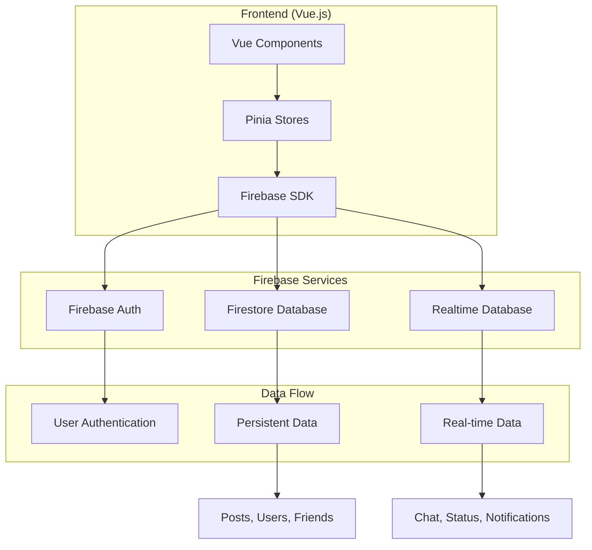
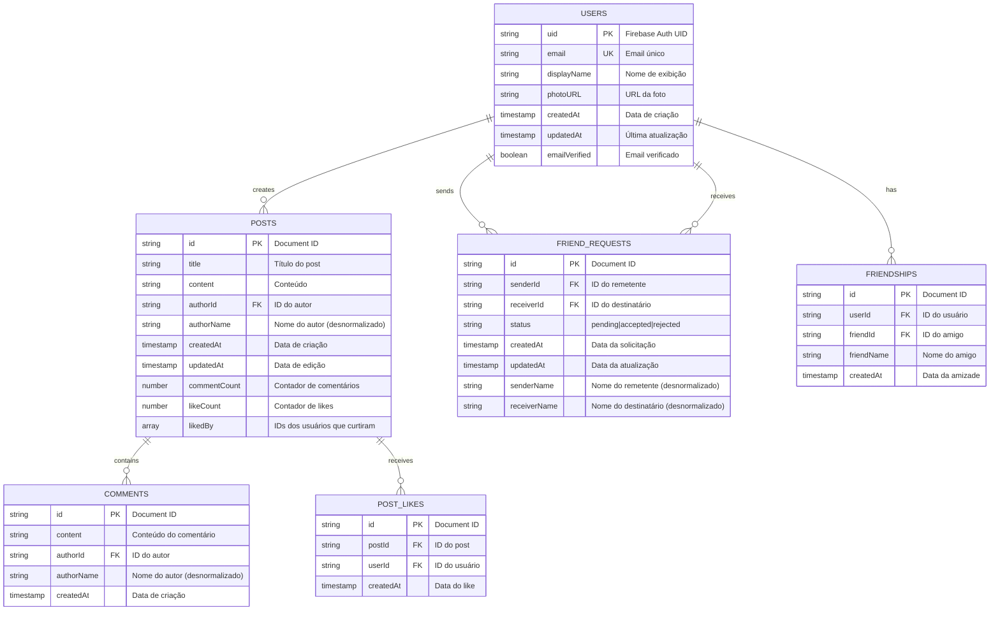
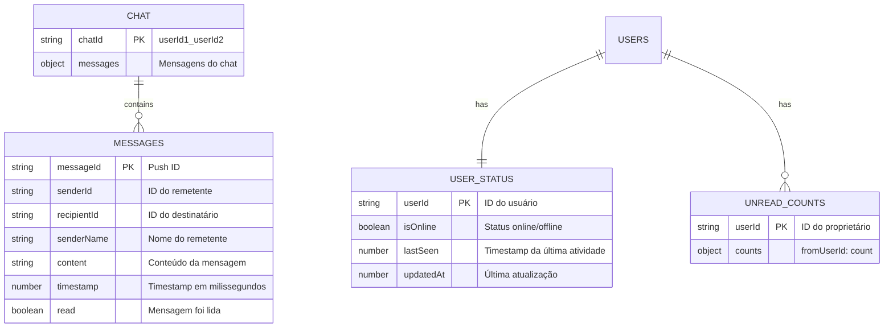
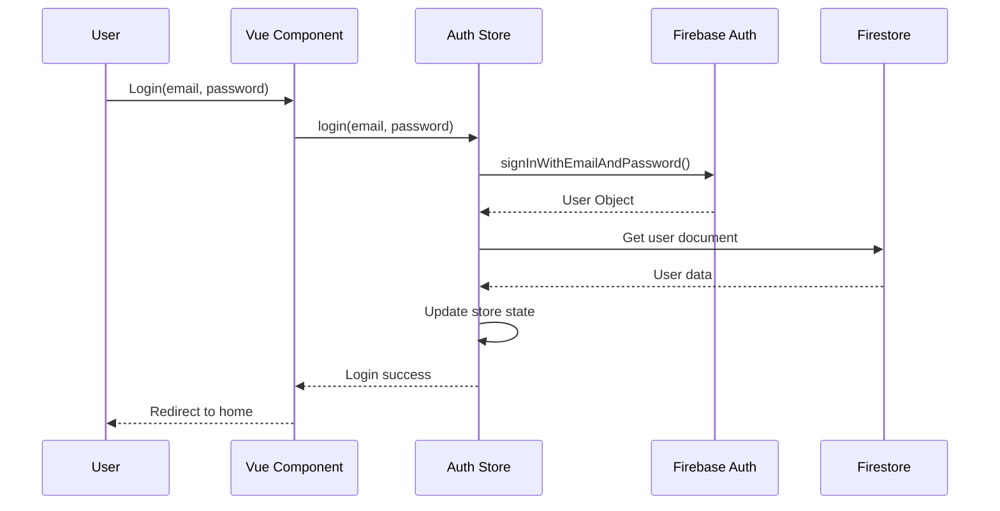
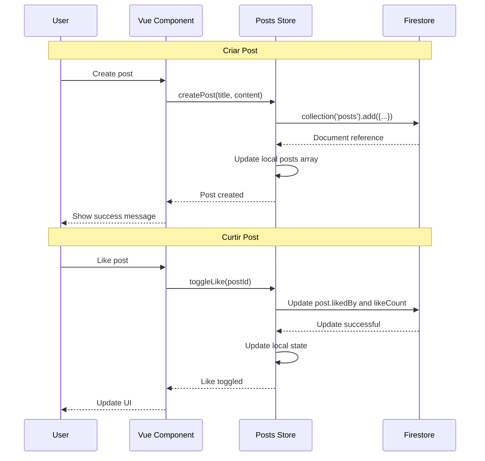
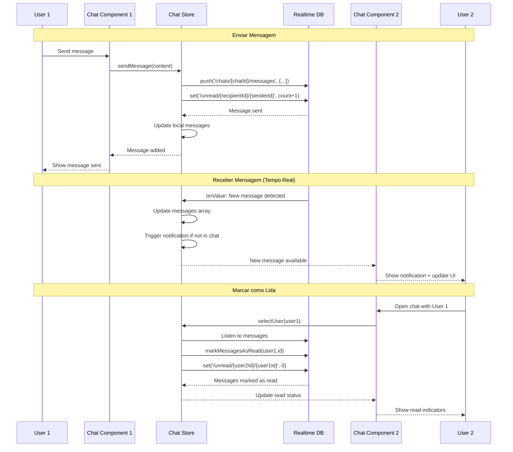
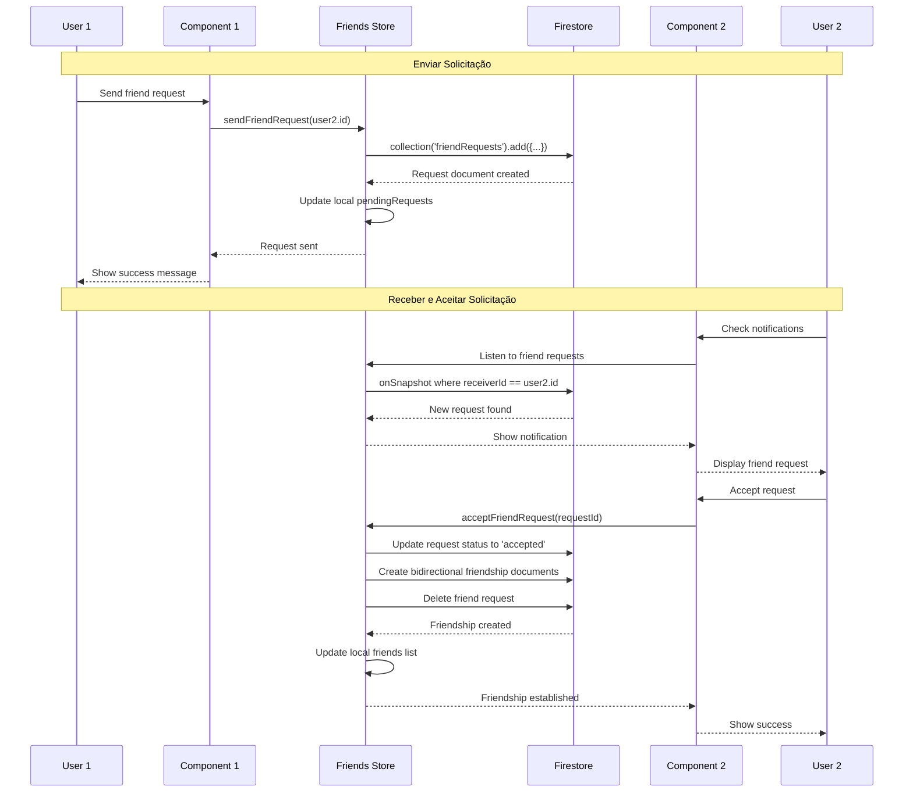

# 📋 Documentação Técnica - Rede Social

## 🏗️ Arquitetura de Dados Firebase

### **Visão Geral da Arquitetura**



## 🗄️ Modelagem Conceitual Firebase

### **Firebase Firestore (Dados Persistentes)**



### **Firebase Realtime Database (Dados em Tempo Real)**



## 🔄 Estrutura Detalhada dos Bancos

### **Firestore Collections Structure**

```
firestore/
├── users/
│   └── {userId}/
│       ├── uid: string
│       ├── email: string
│       ├── displayName: string
│       ├── photoURL?: string
│       ├── createdAt: timestamp
│       ├── updatedAt: timestamp
│       └── emailVerified: boolean
│
├── posts/
│   └── {postId}/
│       ├── id: string
│       ├── title: string
│       ├── content: string
│       ├── authorId: string
│       ├── authorName: string
│       ├── createdAt: timestamp
│       ├── updatedAt: timestamp
│       ├── commentCount: number
│       ├── likeCount: number
│       ├── likedBy: string[]
│       └── comments/ (subcollection)
│           └── {commentId}/
│               ├── id: string
│               ├── content: string
│               ├── authorId: string
│               ├── authorName: string
│               └── createdAt: timestamp
│
├── friendRequests/
│   └── {requestId}/
│       ├── id: string
│       ├── senderId: string
│       ├── receiverId: string
│       ├── status: "pending" | "accepted" | "rejected"
│       ├── createdAt: timestamp
│       ├── updatedAt: timestamp
│       ├── senderName: string
│       └── receiverName: string
│
└── friendships/
    └── {friendshipId}/
        ├── id: string
        ├── userId: string
        ├── friendId: string
        ├── friendName: string
        └── createdAt: timestamp
```

### **Realtime Database Structure**

```
realtime-db/
├── chats/
│   └── {userId1}_{userId2}/
│       └── messages/
│           └── {pushId}/
│               ├── senderId: string
│               ├── recipientId: string
│               ├── senderName: string
│               ├── content: string
│               ├── timestamp: number
│               └── read: boolean
│
├── status/
│   └── {userId}/
│       ├── isOnline: boolean
│       ├── lastSeen: number
│       └── updatedAt: number
│
└── unread/
    └── {userId}/
        └── {fromUserId}: number (count)
```

## 🔧 Comunicação Aplicação ↔ Firebase

### **1. Fluxo de Autenticação**



### **2. Fluxo de Posts (Firestore)**



### **3. Fluxo de Chat (Realtime Database)**



### **4. Fluxo de Sistema de Amizades (Firestore)**


